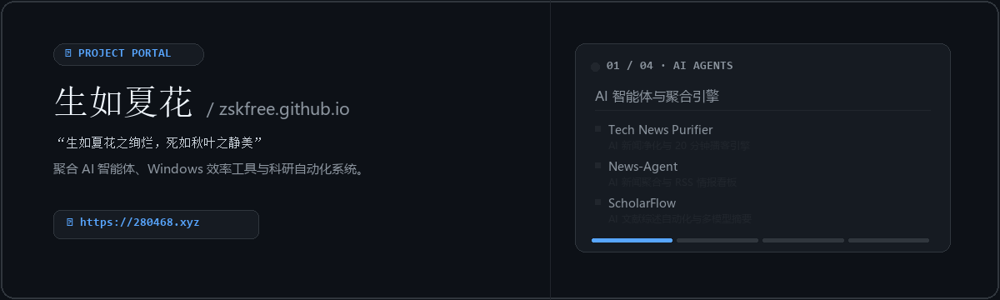

  

  
  
  
  

---

## 🌸 关于本项目 (About)

> **“生如夏花之绚烂，死如秋叶之静美”** 

`zskfree.github.io` 是 **zskfree** 的个人开源项目索引与作品集导航主页。主页秉承极简主义设计哲学，融合高对比度黑白灰阶、衬线体引文、动态微交互与响应式双列网格排布，为所有开源工具与展示系统提供直观、清爽的统一入口。

---

## 🗂️ 核心项目索引 (Featured Projects)

| 类别                      | 项目名称                     | 描述说明                                                                                           |                              快速访问                              |
| :------------------------ | :--------------------------- | :------------------------------------------------------------------------------------------------- | :-----------------------------------------------------------------: |
| 🤖**AI 智能体**     | **Tech News Purifier** | AI 科技新闻净化与 20 分钟播客引擎，多源 RSS 抓取、大模型降噪与 24kbps 单声道音频压制               |         [访问链接](https://www.280468.xyz/tech-news-purifier)         |
| 🤖**AI 智能体**     | **News-Agent**         | AI 新闻聚合与 RSS 情报看板，自动按 AI、科技与市场主题整理每日资讯                                  |             [访问链接](https://www.280468.xyz/News-Agent)             |
| 🤖**AI 智能体**     | **ScholarFlow**        | AI 文献综述自动化工具，支持参考文献智能匹配与多模型摘要生成                                        |             [访问链接](https://www.280468.xyz/ScholarFlow)             |
| ⚡**Windows 效率**  | **PromptOptimizer**    | 轻量无主窗口 Windows 提示词优化助手，选中文字后按 `Ctrl` 快速三击 `A` 自动完成优化并写入剪贴板 |          [访问链接](https://www.280468.xyz/prompt_optimizer)          |
| ⚡**Windows 效率**  | **Minimalist New Tab** | 极简毛玻璃风格新标签页，集成快捷书签、搜索引擎切换与每日高清壁纸                                   |   [访问链接](https://www.280468.xyz/Minimalist-New-Tab/newtab.html)   |
| 📚**科研与学习**    | **How to Learn**       | 科研 AI 工具与科学访问网络教程，覆盖 ChatGPT、Codex、Gemini 与 Clash Verge 配置                    |            [访问链接](https://www.280468.xyz/How_to_learn)            |
| 📚**科研与学习**    | **MdQuiz**             | Markdown 题库练习系统，支持顺序刷题、错题复习、模拟考试与学习统计，内置电力交易员题库              |               [访问链接](https://www.280468.xyz/MdQuiz)               |
| 📚**科研与学习**    | **HTML PPT**           | 基于 Reveal.js 的在线演示文稿，适用于项目展示、数据报告与学术研究分享                              |                [访问链接](https://www.280468.xyz/paper)                |
| 📊**行业 Showcase** | **PowerTrade Demo**    | 脱敏电力交易展示系统，覆盖交易策略报告、负荷天气分析与未来负荷预测                                 | [访问链接](https://www.280468.xyz/PowerTrade/demo_showcase/index.html) |
| 🛠️**实用脚本**    | **深大体育场馆秒约**   | 面向 SZU 场馆预约的 Python 脚本助手，支持定时抢票、自动重试与状态提醒                              |             [访问链接](https://www.280468.xyz/SZU_Sports)             |

---

## ✨ 界面与设计亮点 (Design Highlights)

- 🎨 **极简黑白灰阶 (Minimalist Palette)**：克制优雅的视觉系统，去除冗余视觉杂讯。
- 🎬 **动态 Spotlight 焦点**：顶部高质感动画轮播，依次展示 AI Agent、Windows 工具、科研系统与数据 Showcase。
- 🌓 **双主题无缝切换 (Dark / Light Mode)**：完美支持桌面端与移动端的主题跟随与手动切换。
- 📱 **响应式双列网格 (Responsive Grid)**：主页宽屏自动采用 2 Column 卡片网格，高度收紧，一屏掌握全局。
- 📈 **无侵入统计 (Busuanzi Stats)**：集成不蒜子 PV / UV 访问统计。

---

## 🌐 访问与在线预览 (Live Access)

导航主页可通过以下域名直接在线访问：

- 🔗 **官方主页入口**: [https://www.280468.xyz](https://www.280468.xyz)
- 🐙 **GitHub Pages 镜像**: [https://zskfree.github.io](https://zskfree.github.io)
